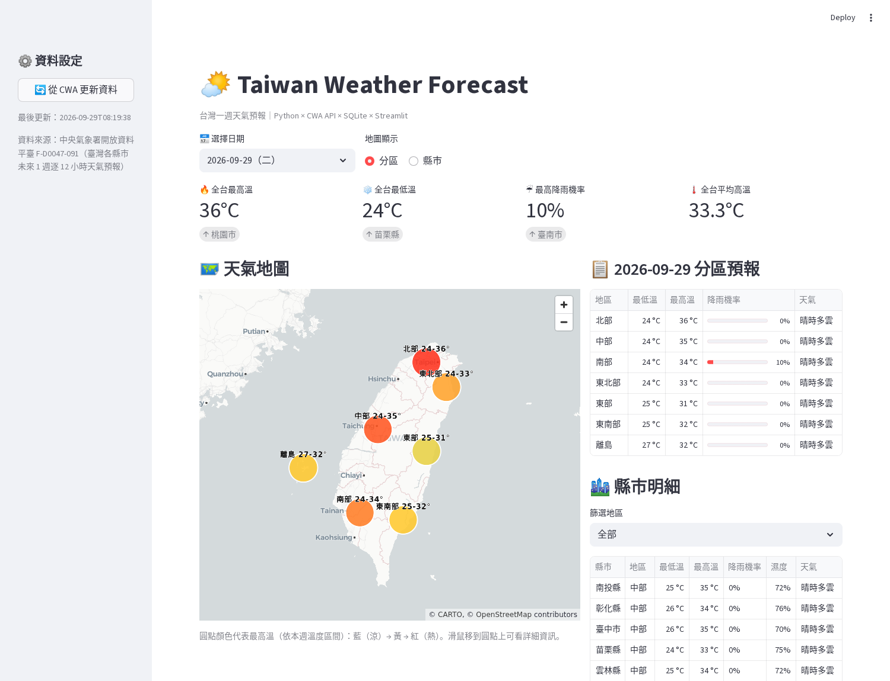
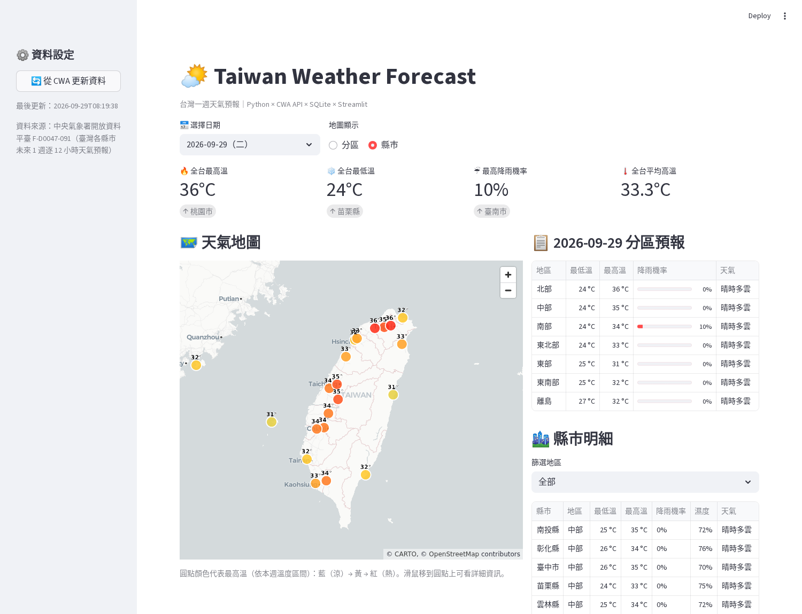
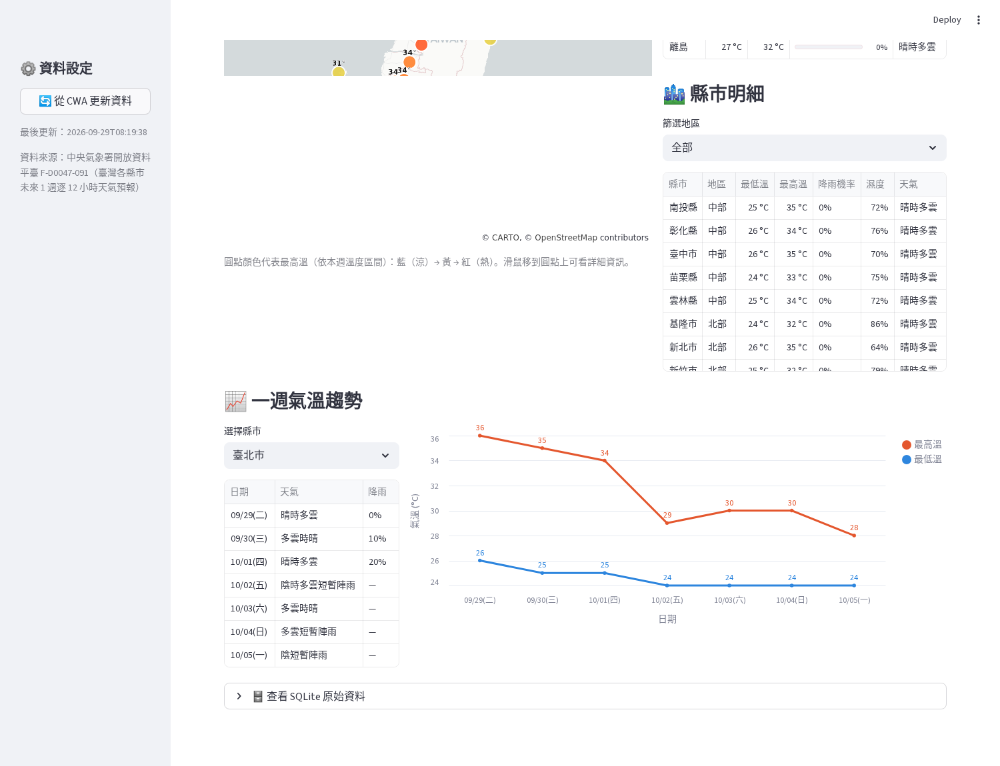

# 🌤️ Taiwan Weather Forecast — CWA 天氣預報網站

AIoT HW1：使用 AI Agent（Vibe Coding）開發的台灣一週天氣預報網站。
從 **中央氣象署（CWA）開放資料 API** 抓取資料 → 解析 JSON → 存入 **SQLite** → 用 **Streamlit** 呈現互動式網頁。

🔗 **線上展示：** https://aiot-hw1-weather.streamlit.app/



## ✨ 功能

- 📅 **日期選擇**：切換未來 7 天的預報
- 🗺️ **互動天氣地圖**：可切換「分區」（北部 / 中部 / 南部 / 東北部 / 東部 / 東南部 / 離島）或「縣市」（22 縣市）顯示，顏色代表最高溫，滑鼠移上去可看天氣、氣溫、降雨機率
- 📋 **分區預報表**：各區最低溫 / 最高溫 / 降雨機率 / 天氣概況
- 🏙️ **縣市明細**：可依地區篩選，含濕度
- 📈 **一週氣溫趨勢圖**：選擇縣市查看 7 天最高 / 最低溫變化
- 🔥 **重點指標**：全台最高溫、最低溫、最高降雨機率、平均高溫
- 🔄 **一鍵更新**：側邊欄按鈕直接從 CWA 重新抓取資料並寫入 SQLite

| 縣市模式 | 一週趨勢 |
|---|---|
|  |  |

## 🧱 系統架構

```
CWA API (F-D0047-091)
      │  src/fetch_cwa.py   Step 1 抓取 JSON
      ▼
  原始 JSON
      │  src/parse_data.py  Step 2 解析：每 12 小時 → 每日，縣市 → 分區
      ▼
  SQLite (data/weather.db)   src/db.py  Step 3 儲存（同縣市同日期會覆蓋更新）
      │
      ▼
  Streamlit (app.py)         Step 4 網頁呈現
```

## 📁 專案結構

```
.
├── app.py               # Streamlit 網頁
├── update_data.py       # 一鍵更新：抓取 → 解析 → 寫入 SQLite
├── src/
│   ├── fetch_cwa.py     # 呼叫 CWA API
│   ├── parse_data.py    # 解析 JSON、縣市分區對照
│   └── db.py            # SQLite 存取
├── data/                # weather.db 與原始 JSON（執行後產生，不上傳）
├── docs/                # 截圖
├── requirements.txt
└── .env.example         # API 金鑰範本
```

## 🚀 執行方式

```bash
# 1. 建立虛擬環境並安裝套件
python -m venv .venv
source .venv/bin/activate        # Windows: .venv\Scripts\activate
pip install -r requirements.txt

# 2. 設定 CWA API 授權碼（到 https://opendata.cwa.gov.tw 註冊取得）
cp .env.example .env             # 然後編輯 .env 填入 CWA_API_KEY

# 3. 抓取資料寫入 SQLite（網頁首次開啟時若無資料也會自動抓取）
python update_data.py

# 4. 啟動網站
streamlit run app.py
```

開啟瀏覽器 http://localhost:8501 即可看到網站。

## ☁️ 部署到 Streamlit Cloud

1. 到 https://share.streamlit.io 用 GitHub 登入 → **Create app** → *Deploy a public app from GitHub*
2. Repository 選 `JuiPiao-Chen/AIoT-HW1`、Branch `main`、Main file path `app.py`
3. **Advanced settings → Secrets** 貼上（格式見 `.streamlit/secrets.toml.example`）：
   ```toml
   CWA_API_KEY = "你的 CWA 授權碼"
   ```
4. 按 **Deploy**。雲端的檔案系統是暫時性的，App 啟動時若資料庫為空、或資料超過 3 小時，會自動從 CWA 重新抓取。

## 🗄️ 資料庫結構

資料表 `forecast`（主鍵：`county` + `date`）

| 欄位 | 說明 |
|---|---|
| county | 縣市 |
| region | 分區（北部、中部、南部、東北部、東部、東南部、離島） |
| date | 日期 |
| min_temp / max_temp | 當日最低 / 最高溫（取白天、晚上兩時段的極值） |
| pop | 12 小時降雨機率（取當日最大值；CWA 僅提供前 3 天） |
| humidity | 平均相對濕度 |
| weather | 天氣現象 |
| lat / lon | 縣市座標 |
| updated_at | 資料更新時間 |

## 📝 開發備註

- 原本規劃使用 F-A0010-001（一週農業氣象預報，天然就是六大分區），但該資料集已無法透過 API 取得，因此改用 **F-D0047-091（臺灣各縣市未來 1 週逐 12 小時天氣預報）**，再自行依縣市對應成分區。
- 分區的最低溫取區內各縣市最小值、最高溫取最大值，代表該區的氣溫範圍。
- pydeck 會把字串參數當成 JS 運算式，因此 TextLayer 的 `character_set` / `font_family` 需用 `json.dumps(..., ensure_ascii=False)` 包成字串常值，中文標籤才能正常顯示。

## 🛠️ 使用工具

AI Agent（Claude Code）· Python · CWA Open Data API · SQLite · Streamlit · pydeck · Altair · GitHub
